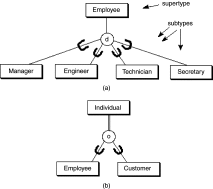
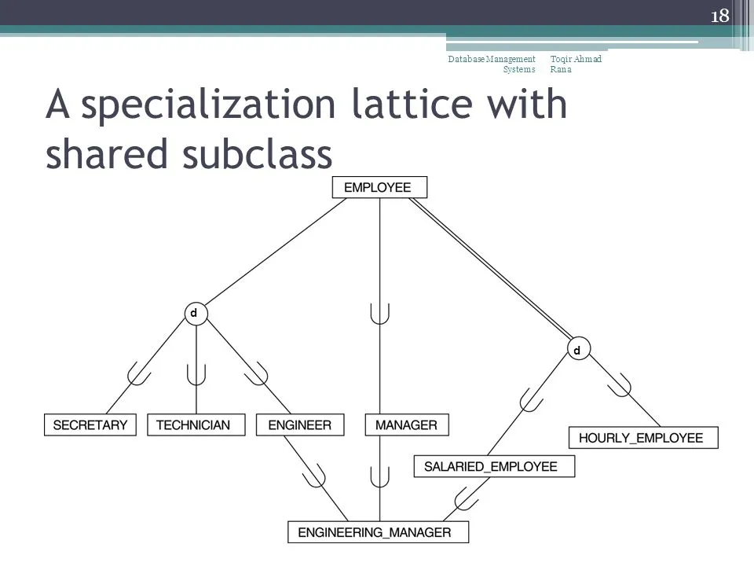
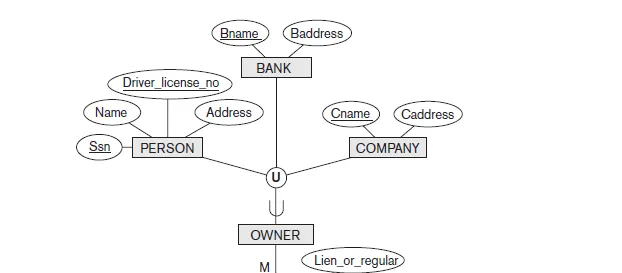

- chapter 4️⃣
    
    # Enhanced Entity Relationship (EER) Modeling
    
    ## Concepts:
    
    - Subclasses / Superclasses
    - Specialization / Generalization
    - Categories ( UNION types )
    - Attribute and relationship inheritance
    
    ## Subclasses / Superclasses :
    
       in many cases an entity type has different subgroupings of its entities that are  
    
          meaninigful and need to be represented explicity
    
    - Subclass ⇒ Subgrouping
    - Superclass ⇒ Entity
    - Local Atrribute ⇒ attribute for one of subclasses
    
    ## Specialization
    
    is the process of defining subclasses of a superclass
    
    - **Reasons to specialize:**
        1. some attributes may not allow to all superclass
        2. some relationship may allow to some of subclass
    
    ## Generalization
    
    - Generalization is the process of extracting common properties from a set of entities and creating a generalized entity from it. It is a bottom-up approach
    - collect attributes which common in subclasses to superclass
    
    ## Constraints on specialization and generalization
    
    - **Disjointness**
        - entity member at one subclass only ( d ) character
        
        Overlapping ⇒ entity member at more than one subclass ( O ) character
        
        
        
    - **Competeness**
        - the superclass must be a member of some subclasses.
        - show in EER by a double line
    
    Hierarchy ⇒ every subclass has one superclass ( single inheritance )
    
    Lattice ⇒ Subclass may have more than one superclass ( multiple inheritance )
    
    
    
    ## Categories (Union of super-classes)
    
    - It is a method to collect super-classes in entity to connect it with other relationship and entities
    - show in EER diagram by ( U )
    
    shared class ⇒ intersection between superclasses
    
    
    
